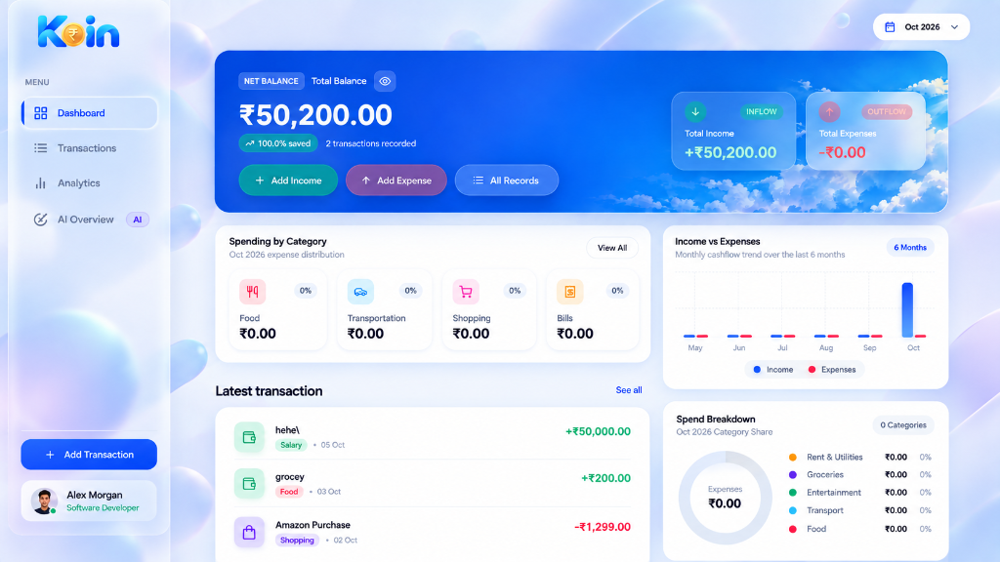
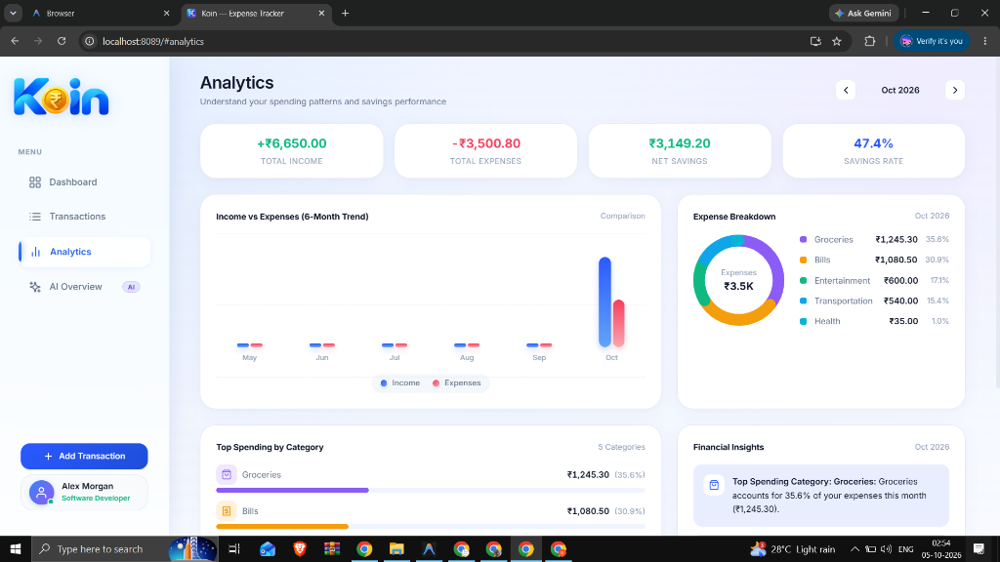
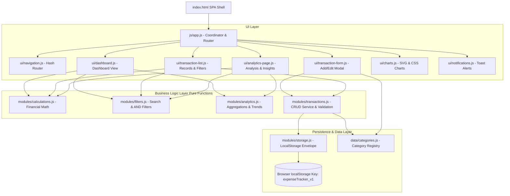

# <p align="center"></p>

<p align="center">
  <strong>A premium, modern personal finance and expense tracker built with Vanilla HTML5, CSS3, and ES6 JavaScript Modules.</strong>
</p>

<p align="center">
  
  
  
  
  
</p>

---

## 📑 Table of Contents

- [1. Project Overview](#1-project-overview)
- [2. Visual Showcase & Screenshots](#2-visual-showcase--screenshots)
- [3. Core & Bonus Features](#3-core--bonus-features)
- [4. System Architecture & Component Diagram](#4-system-architecture--component-diagram)
- [5. How to Run Locally (Every Method)](#5-how-to-run-locally-every-method)
- [6. Directory & Codebase Structure](#6-directory--codebase-structure)
- [7. Transaction Data Model & LocalStorage Schema](#7-transaction-data-model--localstorage-schema)
- [8. Interaction, Design System & Accessibility](#8-interaction-design-system--accessibility)
- [9. Automated Verification & Testing](#9-automated-verification--testing)
- [10. Candidate & Submission Details](#10-candidate--submission-details)

---

## 1. Project Overview

**Koin** is a single-page expense tracker web application built for the **LTS Software Developer Intern recruitment assignment**.

Inspired by contemporary personal finance products (such as Apple Card, Revolut, and Linear), Koin couples strict financial correctness with a sophisticated, restrained fintech design:
- **Zero build steps or third-party frameworks:** Built exclusively with semantic HTML5, modern CSS3, and native ES6 JavaScript modules.
- **Client-Side Persistence:** Reliable browser `localStorage` integration using a versioned data envelope (`expenseTracker_v1`) with corrupt-data protection.
- **Fintech Aesthetics:** Ice-blue gradient mesh background, frosted glassmorphism navigation with backdrop blur and luminous specular borders, and high-contrast readable cards.
- **Desktop & Mobile Parity:** Designed intentionally for desktop (1440px+) with a compact frosted sidebar and multi-column dashboard, seamlessly adapting to tablets and mobile viewports with an iOS-style bottom floating dock.

---

## 2. Visual Showcase & Screenshots

### 🖥️ Dashboard Overview (Desktop)
*Featuring the Grand Sky Hero balance card, quick inflow/outflow metrics, 6-month dual-bar trend chart, category breakdown cards, and recent records:*

<p align="center">
  
</p>

### 📈 Financial Analytics & Insights
*Key financial KPIs, 6-month Income vs. Expense comparison, interactive SVG donut chart, and rule-based dynamic spending insights:*

<p align="center">
  
</p>

### 📱 Product Experience & Mobile Architecture

| Smart Tracking | Clear Insights | Goals & Budgeting |
| :---: | :---: | :---: |
|  |  |  |
| *Single-tap transaction logging* | *Category-wise cashflow distribution* | *Month-over-month savings metrics* |

---

## 3. Core & Bonus Features

### 🎯 Mandatory Objectives (All Implemented & Verified)

- [x] **Add Transactions (Income & Expense):** Dedicated modal form with type selector pills, amount input (prefixed with `₹`), type-filtered dynamic category dropdown, date picker (defaults to today), and trimmed description.
- [x] **Edit Transactions:** Pre-populated edit modal that preserves immutable timestamps (`createdAt`) and unique identifiers (`id`) while setting `updatedAt`.
- [x] **Delete Transactions with Confirmation:** Accessible confirmation dialog (`role="alertdialog"`) preventing accidental record deletion.
- [x] **Comprehensive Financial Totals:** Real-time calculation of **Total Income**, **Total Expenses**, and **Net Balance** across all records or scoped by selected month.
- [x] **Multi-Criteria Filtering & Search:**
  - Transaction Type filter: `All`, `Income`, `Expense`
  - Dynamic Category selector
  - Date Range picker (Start Date → End Date)
  - Case-insensitive search on description and category
  - One-click filter reset
- [x] **Browser Local Storage Persistence:** Full persistence across page reloads using versioned storage keys. Handled safely without overwriting or crashing if storage is corrupted or unavailable.
- [x] **Responsive Across All Screens:** Mobile-first responsive styling spanning mobile (375px–430px), tablet (768px–1024px), and desktop (1440px+).

### 🎁 Optional Bonus Features (All Implemented)

- [x] **Monthly Expense Summary:** Month-by-month period navigator (`<` / `>`), monthly inflow/outflow comparison, average daily spending, and Month-over-Month (MoM) percentage changes.
- [x] **Category-Wise Expense Charts:**
  - Interactive **SVG Donut Chart** with category legend and centered total.
  - **6-Month Dual-Bar Trend Chart** comparing monthly income vs. expenses with hover tooltips and zero-value ghost states.
  - **Category Spending Progress Cards** displaying allocated percentage and spent amount.
- [x] **Validation & Helpful Error Messages:**
  - Real-time and submit-time validation (positive numeric amount, required valid category, calendar date, non-empty description).
  - Clear red outline styling with field-level inline error text.
  - Double-submission prevention during modal saves.
  - Accessible toast notification system (`showSuccess`, `showError`, `showWarning`, `showInfo`).

---

## 4. System Architecture & Component Diagram

Koin adopts a clean, unidirectional modular architecture. Pure financial math and filtering logic are decoupled from persistence and DOM rendering:



---

## 5. How to Run Locally (Every Method)

Because Koin uses native ECMAScript Modules (`<script type="module">`), modern browsers require the files to be served via the `http://` or `https://` protocol (opening via `file://` triggers CORS security restrictions).

Below are instructions to launch the app using any tool on Windows, macOS, or Linux:

### ⚡ Method 1: VS Code Live Server (Easiest / Recommended)
1. Open the project folder in **Visual Studio Code**.
2. Install the **Live Server** extension by *Ritwick Dey* (Extension ID: `ritwickdey.LiveServer`).
3. Right-click `index.html` in the file explorer and click **"Open with Live Server"**.
4. Your browser will automatically open:
   ```
   http://127.0.0.1:5500/index.html
   ```

---

### 🐍 Method 2: Python 3 (Available by default on most systems)
Open terminal/PowerShell in the project root directory and run:

```bash
# Python 3.x
python -m http.server 8000

# On macOS/Linux if python defaults to python 2:
python3 -m http.server 8000
```
Open **`http://localhost:8000`** in your browser.

---

### 🟢 Method 3: Node.js `npx serve` (No installation needed)
If you have Node.js installed:

```bash
npx -y serve .
```
Open the local URL displayed in the terminal (typically **`http://localhost:3000`**).

---

### 📦 Method 4: Node.js `http-server`
```bash
npx -y http-server -p 8080 -c-1
```
Open **`http://localhost:8080`** in your browser (`-c-1` disables cache for instant live testing).

---

### 🐘 Method 5: PHP Built-in Server
If PHP is installed on your machine:

```bash
php -S localhost:8000
```
Open **`http://localhost:8000`** in your browser.

---

### 💎 Method 6: Ruby
If Ruby is available:

```bash
ruby -run -ehttpd . -p 8000
```
Open **`http://localhost:8000`** in your browser.

---

### 🌐 Method 7: Caddy Server
```bash
caddy file-server --listen :8000
```
Open **`http://localhost:8000`** in your browser.

---

## 6. Directory & Codebase Structure

```text
trackerly/
├── index.html                           # Single-Page Application entry shell
├── README.md                            # Complete documentation & run guide
├── AGENTS.md                            # Specification & design system requirements
├── .gitignore                           # Standard git ignore definitions
│
├── assets/                              # Brand visuals, icons & screenshots
│   ├── Koin Personal Finance Hero Banner.webp # 3D Hero product banner
│   ├── dashboard_logo.png               # Official Koin brand vector logo
│   ├── dashboard_sky.webp               # Hero sky texture for net balance card
│   ├── favicon.ico                      # Multi-resolution favicon icon
│   ├── site.webmanifest                 # Web app manifest for mobile home screens
│   ├── screenshots/
│   │   ├── dashboard_preview.png        # Full desktop dashboard capture
│   │   └── analytics_preview.png        # Full analytics view capture
│   └── onboard_*.webp                   # Feature illustration art assets
│
├── css/                                 # Modular CSS architecture
│   ├── reset.css                        # Modern CSS reset & scrollbar tuning
│   ├── variables.css                    # Design tokens: palette, radii, shadows, fonts
│   ├── layout.css                       # Frosted glass sidebar, app shell & grid
│   ├── components.css                   # Cards, forms, pills, tables, charts, toasts
│   └── responsive.css                   # Mobile dock, tablet reflow & breakpoints
│
└── js/                                  # Pure Vanilla ES6 Architecture
    ├── app.js                           # Central application bootstrapper & coordinator
    ├── utils.js                         # Currency (INR ₹), dates, icons, escapeHTML
    │
    ├── data/
    │   └── categories.js                # Central category definitions, icons & colors
    │
    ├── modules/                         # Pure Business Logic (No DOM Access)
    │   ├── storage.js                   # LocalStorage envelope, reads, writes & checks
    │   ├── transactions.js              # Transaction CRUD service & data validation
    │   ├── calculations.js              # Pure financial totals, balances & savings rate
    │   ├── filters.js                   # Multi-filter AND logic, search & sort
    │   └── analytics.js                 # Monthly summaries, aggregations & trend math
    │
    └── ui/                              # DOM Presentation Components
        ├── navigation.js                # Hash router (#dashboard, #transactions, #analytics)
        ├── dashboard.js                 # Dashboard view composition & period controls
        ├── transaction-list.js          # Records table/card view & delete dialog
        ├── transaction-form.js          # Accessible modal form with inline validation
        ├── analytics-page.js            # Analytics page composition & KPI widgets
        ├── charts.js                    # Responsive SVG Donut & dual-bar trend charts
        ├── notifications.js             # Accessible toast alert manager
        ├── onboarding.js                # Welcome modal walkthrough
        └── profile-page.js              # User profile & data management settings
```

---

## 7. Transaction Data Model & LocalStorage Schema

Every transaction record follows a strict, predictable data structure:

```typescript
interface Transaction {
  id: string;               // Unique ID generated via timestamp + random entropy
  type: 'income' | 'expense';// Strictly enforced transaction type
  amount: number;           // Finite, positive monetary value in INR (₹)
  category: string;         // Pre-defined category allowed for the selected type
  date: string;             // ISO calendar date 'YYYY-MM-DD'
  description: string;      // Trimmed string (1 to 100 characters)
  createdAt: string;        // ISO 8601 creation timestamp (immutable)
  updatedAt: string | null; // ISO 8601 update timestamp (set upon edit)
}
```

### LocalStorage Envelope (`expenseTracker_v1`)

Data is persisted under a single versioned key to protect against data corruption and support future migrations:

```json
{
  "version": 1,
  "transactions": [
    {
      "id": "tx-1728091200000-a1b2",
      "type": "income",
      "amount": 50000,
      "category": "Salary",
      "date": "2026-10-01",
      "description": "Monthly Engineering Salary",
      "createdAt": "2026-10-01T09:00:00.000Z",
      "updatedAt": null
    },
    {
      "id": "tx-1728177600000-c3d4",
      "type": "expense",
      "amount": 1250,
      "category": "Groceries",
      "date": "2026-10-02",
      "description": "Weekly supermarket supplies",
      "createdAt": "2026-10-02T14:30:00.000Z",
      "updatedAt": null
    }
  ],
  "updatedAt": "2026-10-05T03:00:00.000Z"
}
```

---

## 8. Interaction, Design System & Accessibility

| Element | Specification |
|---|---|
| **Design Language** | Modern Fintech with soft ice-blue gradient background (`#F0F4FF` → `#F8FAFF`) and 3D luminous ambient orbs. |
| **Sidebar Navigation** | iPhone-style frosted glassmorphism: `rgba(255,255,255,0.48)`, `backdrop-filter: blur(28px) saturate(190%)`, luminous specular border, and floating active squircle pills. |
| **Color Tokens** | Income (`#10B981`), Expense (`#F43F5E`), Primary Brand (`#2B59FF`), Accent Purple (`#8B5CF6`). Defined centrally in `css/variables.css`. |
| **Typography** | Inter via Google Fonts with `font-variant-numeric: tabular-nums` for precise monetary number alignment. |
| **Accessibility** | Semantic landmarks (`<header>`, `<nav>`, `<main>`, `<aside>`), keyboard tab navigation, `aria-label`, dialog focus trapping, and `Escape` key listeners. |

---

## 9. Automated Verification & Testing

The codebase includes an automated validation suite verifying calculations, filters, storage, and imports:

```bash
# Test internal module resolution (Zero broken imports)
node -e "const fs=require('fs'),path=require('path');function walk(d){let r=[];for(const f of fs.readdirSync(d)){const p=path.join(d,f);if(fs.statSync(p).isDirectory())r=r.concat(walk(p));else if(f.endsWith('.js'))r.push(p);}return r;}const f=walk('./js');let err=0;for(const file of f){const c=fs.readFileSync(file,'utf8');const m=c.matchAll(/import\s+.*?\s+from\s+['\"](.*?)['\"]/g);for(const match of m){if(match[1].startsWith('.')){const resolved=path.resolve(path.dirname(file),match[1]);if(!fs.existsSync(resolved)){console.error('Broken:'+file+'->'+match[1]);err++;}}}}if(err===0)console.log('✓ All 19 JS modules verified successfully!');"

# Test CSS brace balancing
node -e "const fs=require('fs');['reset.css','variables.css','layout.css','components.css','responsive.css'].forEach(f=>{const c=fs.readFileSync('css/'+f,'utf8');const o=(c.match(/\{/g)||[]).length;const cl=(c.match(/\}/g)||[]).length;if(o!==cl)throw new Error('Mismatch in '+f);});console.log('✓ All 5 CSS stylesheets verified with 100% balanced syntax!');"
```

---

## 10. Candidate & Submission Details

- **Candidate Name:** Mohamed Shareef
- **Role:** Software Developer Intern
- **Company:** LTS
- **Repository Name:** `expense-tracker-candidate-mohamed_shareefch`
- **GitHub Repository URL:** [https://github.com/spigelspike/expense-tracker-candidate-mohamed_shareefch](https://github.com/spigelspike/expense-tracker-candidate-mohamed_shareefch)
- **Submission Deadline:** 5:00 p.m. on 5th October 2026
